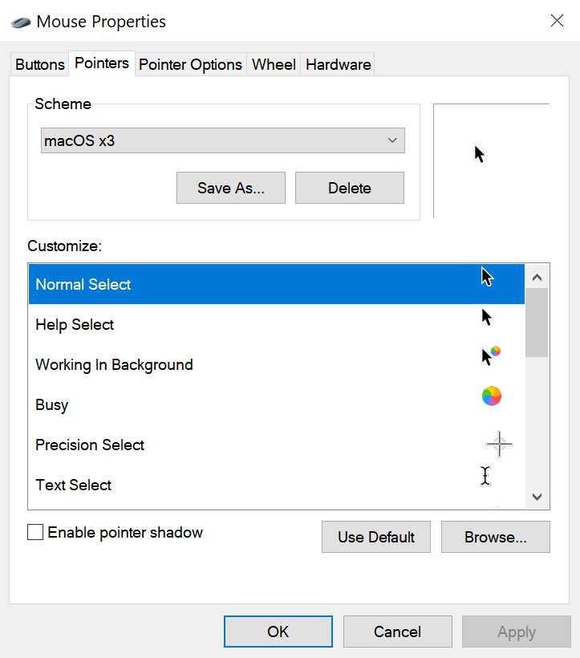

# Windows Cursors - macOS

macOS cursors for Microsoft Windows operating systems

# Installation

1. Navigate to the [Releases](https://github.com/oxou/windows-cursors-macos/releases) page
2. Download the latest 7z archive and extract it
3. Read the further instructions inside `readme.txt`
